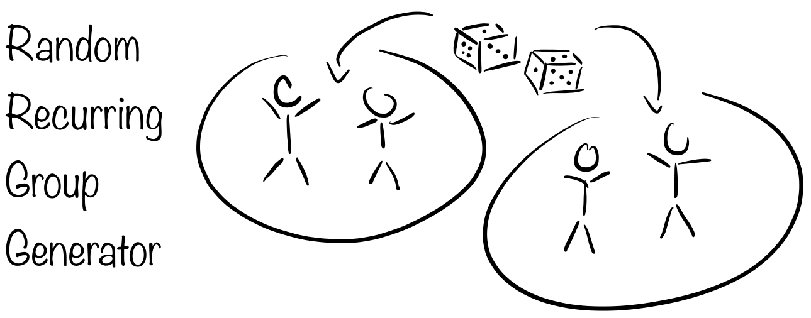

[](https://opensource.org/licenses/MIT)
[](https://github.com/psf/black)
[](https://codecov.io/gh/timmens/random-grouping)
[](https://github.com/timmens/randomg-grouping/actions?query=branch%3Amain)

# Introduction

This package exports a single function called `create_matching` which can be used to
create matchings for recurring meetings from a varying but overlapping set of members.
In particular, the internal algorithm makes sure that matchings at different meetings
are mixed.

# Installation

The package can be installed via pip. To do so, type the following commands in your
favorite terminal emulator:

```console
$ pip install randomgroups
```

# Usage

The code expects a data file containing *id*, *name*, and *joins* columns, where *id* is
used internally to keep track of matchings, *name* is a str column which is used when
creating the human-readable output and *joins* is a {0, 1} column which denotes if the
given individual wants to join the current meeting. An example file is given here
[names.csv](https://github.com/timmens/random-grouping/blob/main/tests/data/names.csv).
Note that the rows in *id* column have to be unique. If new individuals wish to be added
these individuals simply need to be appended to the data file, the code will update all
further files automatically.

**First Time Use:**

If no prior matchings have been recorded you can create a new set of groups by running
the following lines in a Python shell

```python
from randomgroups import create_matching

names_path = "/path/to/names.csv"
output_path = "/path/to/folder/where/to/store/output/data"

create_matching(
    names_path=names_path,
    output_path=output_path,
    min_size=2,
)
```

Here the argument `min_size` denotes the minimum number of members in a group. In the
folder `output_path` two files will be created. One, `matchings.txt` which contain the
named matchings for the current meeting, and second, `matchings_history.csv` which
contains information on matchings. The latter file needs to be saved since it will be
used in subsequent function calls. Example files are given here:
[matching.txt](https://github.com/timmens/random-grouping/blob/main/tests/data/matching.txt),
[matchings_history.csv](https://github.com/timmens/random-grouping/blob/main/tests/data/matchings_history.csv).

*Remark:* If the files `names.csv` is a Google sheet which is updated on a regular basis
it can be sensible not to download the file but to provide a link to the sheet directly.
In the case with Google sheets this is easily done by opening the Google sheet and then
publishing the document in the file options. This creates a link to a downloadable csv
file which updates when the Google sheet is updated. This URL can then be passed to
`names_path`.

**Subsequent Usage:**

Once the file `matchings_history.csv` has been created one can further pass the path of
this file to the function call via `matchings_history_path=...`. The previous matchings
will then influence new group formations.

**Assortative Matching:**

The 'status' column in the names csv-file allows one to distinguish between different
statuses like 'student' or 'faculty'. One can then use the 'wants_mixing' column to
specify whether an individual wants to be mixed with people from another group. This is
not absolute. A float parameter ("mixing_multiplier") can be specified. If this
parameter is very high it will be less likely that people with a different status and
which do not want to mix are mixed. In fact, a negative value will make it more likely
that people with a different status are mixed. Multiple status columns can be used,
e.g., "status", "status2", etc. and a dict of mixing multipliers can be passed to get
different mixing multipliers for different status columns.

# Contributing

If you want to contribute to this repository feel free to open a pull request or submit
an issue. You can also simply contact me, see [here](https://github.com/timmens).
