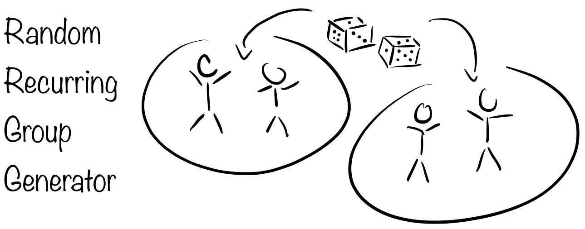

.. image:: https://anaconda.org/timmens/randomgroups/badges/version.svg
   :target: https://anaconda.org/timmens/randomgroups

.. image:: https://anaconda.org/timmens/randomgroups/badges/platforms.svg
   :target: https://anaconda.org/timmens/randomgroups

.. image:: https://img.shields.io/badge/License-MIT-yellow.svg
    :target: https://opensource.org/licenses/MIT
    :alt: License

.. image:: https://img.shields.io/badge/code%20style-black-000000.svg
    :target: https://github.com/psf/black

Use Case
--------

This package exports a single function called ``create_groups`` which can be used to
to create groups for different meetings from a varying but overlapping set of members.
In particular the internal algorithm makes sure that group matchings in different
meetings are mixed.

Installation
------------

The package can be installed via conda. To do so, type the following commands in your
favorite terminal emulator:

.. code-block:: bash

    $ conda config --add channels conda-forge
    $ conda install -c timmens randomgroups

How to Use
----------

The code expects a csv file containing *id*, *name*, and *joins* columns, where *id*
is used internally to keep track of matchings, *name* is a str column which is used
when creating the human-readable output and *joins* is a {0, 1} column which denotes
if the given individual wants to join the current meeting. An example file is given
here `names.csv <https://github.com/timmens/random-grouping/blob/main/example_data/names.csv>`_.
Note that the rows in *id* column have to be unique. If new individuals wish to be added
these individuals simply need to be appended to the data file, the code will update all
further files automatically.

**First Time Use:**

If no prior matchings have been recorded you can create a new set of groups by running
the following lines in a Python shell

.. code-block:: Python3

    from randomgroups import create_groups

    name_path = "/path/to/names.csv"
    output_path = "/path/to/folder/where/to/store/output/data"

    create_groups(
        names_path=names_path,
        output_path=output_path,
        min_size=3,
    )

Here the argument ``min_size`` denotes the minimum number of members in a group. In the
folder ``output_path`` two files will be created. One, ``matchings.txt`` which contain
the named matchings for the current meeting, and second, ``matchings_history.csv`` which
contains information on matchings. The latter file needs to be saved since it will be
used in subsequent function calls. Example files are given here: `matching.txt <https://github.com/timmens/random-grouping/blob/main/example_data/matching.txt>`_,
`matchings_history.csv <https://github.com/timmens/random-grouping/blob/main/example_data/matchings_history.csv>`_.

**Subsequent Usage:**

Once the file ``matchings_history.csv`` has been created one can further pass the path
of this file to the function call via ``matchings_history_path=...``. The previous
matchings will then influence new group formations.

Contributing
------------

If you want to contribute to this repository feel free to open a pull request or submit
an issue. You can also simply contact me, see `here <https://github.com/timmens>`_.
